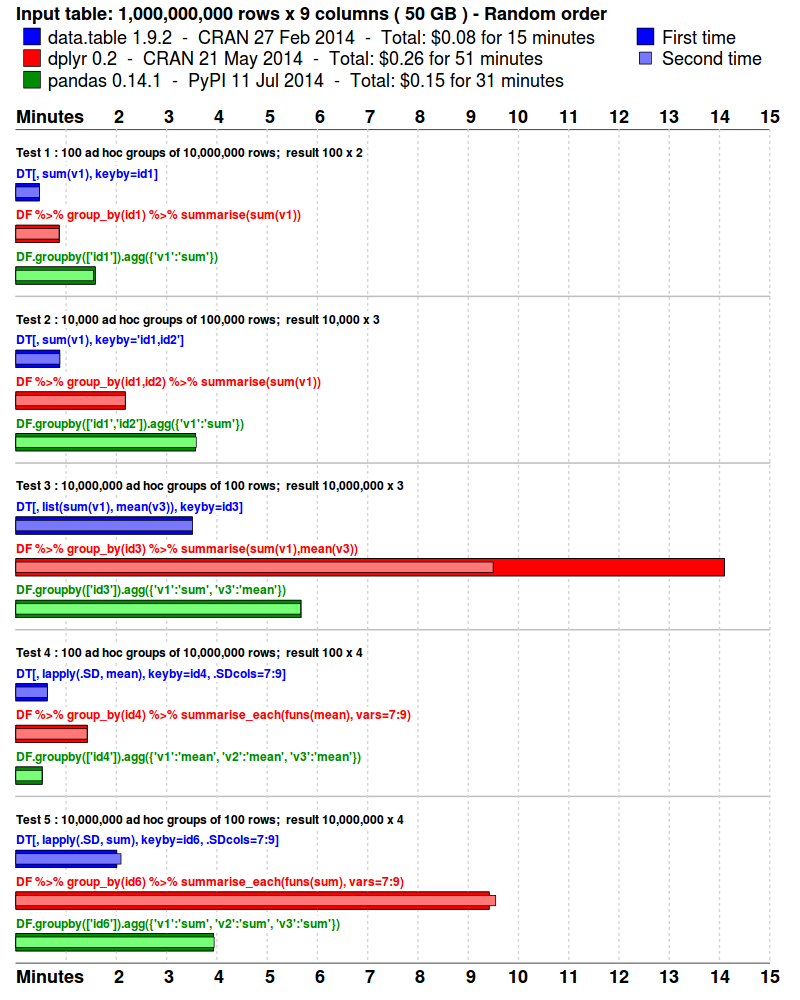
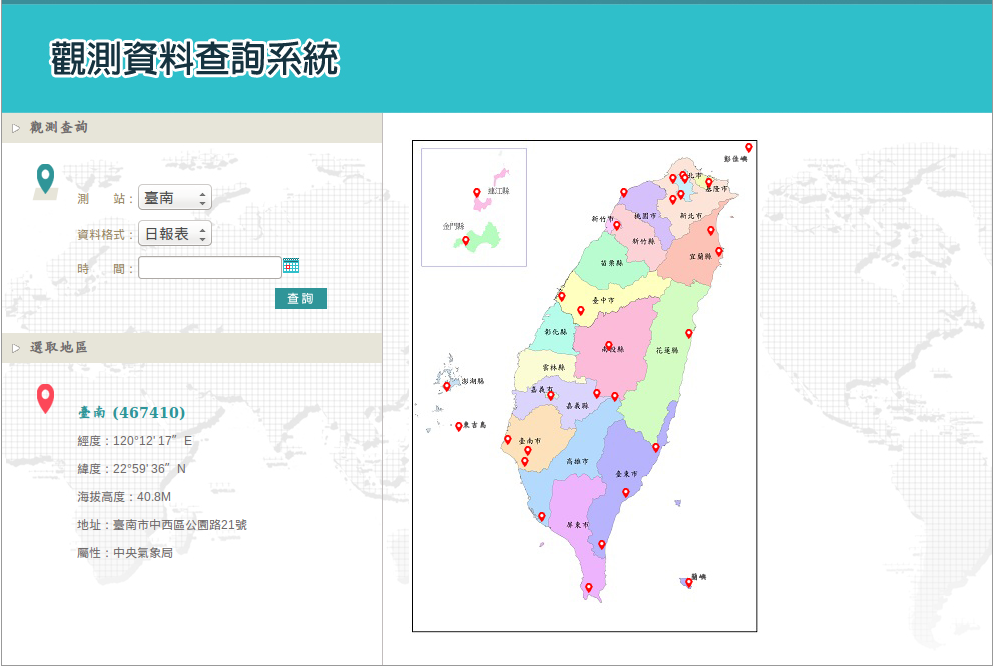

```{r include=FALSE}
library(knitr)
knitr::opts_chunk$set(warning = TRUE,
                      echo = TRUE,
                      message = TRUE,
                      fig.align='center',
                      cache=FALSE)
```


# data.table {.white .Section}


# Aims of this lecture

- An overall introduction for most-used feature of data.table with minimum examples
- A case study of using data.table for data-preprocessing tasks
- Common mistakes when using data.table


# What is data.table

- An enhanced version of data.frames
- Optimize most heavy works in C
- Minimize redundant copies
- Fast and friendly file I/O
- Build-in data manipulation toolchain


# Why data.table

- Speed
- Automatic optimization
- Total solution for ETL
- Concise syntax


# Benchmarks

[Benchmarks : Grouping](https://github.com/Rdatatable/data.table/wiki/Benchmarks-%3A-Grouping)

<div>



</div>


# Installation

Here we use data.table v1.9.7


Install development version of data.table:

```r
install.packages("data.table", type = "source",
    repos = "https://Rdatatable.github.io/data.table")
```

or

```r
devtools::install_github("Rdatatable/data.table")
```

Load package:

```r
library(data.table)
```


# General Form

**DT[i, j, by]**

<br>

Compare with SQL:

R:     i       j               by
----- ------- --------------- -----------  
SQL:   where   select/update   group by
----- ------- --------------- -----------

<br>

Say it loud:

> Take **DT**, subset rows using *i*, then calculate *j* grouped by *by*.


# Your first data.table

You can create a data.table just like the way you create
a data.frame. 
It don't convert character to factor by default.

```{r}
library(data.table)
team = data.table(name = c("Wendy", "Alice", "James", "Bill"),
                  gender = c("f", "f", "M", "M"),
                  age = c(26, 24, 28, 32))
```

or convert a data.frame into data.table:

```{r}
teamdf = data.frame(name = c("Wendy", "Alice", "James", "Bill"),
                    gender = c("f", "f", "M", "M"),
                    age = c(26, 24, 28, 32),
                    stringsAsFactors = FALSE)
teamdt = data.table(teamdf)
identical(team, teamdt)
```


# data.table is a data.frame, too

```{r}
class(team)
```

You can use any functions that suitable for data.frame with data.table.
Note that the behavior of `[` operator is slightly different than data.frame.

<div class="double">
<div class="double-flow">
```{r}
team$gender
team[[2]]
team[2]
```
<br>
<br>
<br>
</div>
<div class="double-flow">
```{r}
teamdf$gender
teamdf[[2]]
teamdf[2]
```
</div>
</div>


# Subset with *i*

Use *i* to subset a data.table is similar to data.frame. 
Furthermore, expression is evaluated within the frame of the data.table

```{r}
team[1, ]
team[c(FALSE, FALSE, FALSE, TRUE), ]
team[name == "Wendy", ]
team[name %in% c("Wendy", "Alice"), ]
```


# Select with *j*

- **.** is an abbreviation of list within data.table 
- *j* accepts a list of expression to select columns


```{r}
team[, .(gender)]
team[1, .(sex = gender)]
team[1, .(name, gender)]
```


# Degeneration

If you don' wrap a single expression with list in *j*, 
the output will degenerate into a vector.

```{r}
team[, gender]
```


If you want to know how old is Wendy:

```{r}
team[name == "Wendy", age]
```


# With

Because *j* handle expressions, you need to set **with = FALSE** when slicing with logical, interger or character vector

```{r}
team[1, c("gender")]    # not works
team[1, c(TRUE, FALSE, TRUE), with = FALSE]
team[1, c(1, 3), with = FALSE]
team[1, c("name", "age"), with = FALSE]
```


# Assignment by reference

**:=** add/remove/update subsets of column by reference.

- LHS := RHS form

```{r}
team[, id := 1:4]   # add a column 
team[name == "James", age := 38]  # UPDATE age for james
team[name == "Bill", c("name", "age") := .("Billy", 34)] # update 2 columns 
team[, id := NULL]  # remove id
```

- Functional form

```{r}
team[gender == "f", `:=`(gender = "F", age = age + 5)]
team
```


# More calculation with *j*

Use a list of expression in *j* to compute with data.table

```{r}
stat = team[, .(mean_age = mean(age), sd_age = sd(age))]
stat
```

Add a new column:

```{r}
team[, mean_age := mean(age)]
team
```

Note that putting *:=* inside *.()* doesn't work:  

```r
stat = team[, .(mean_age := mean(age), sd_age := sd(age))] # not works
```


# Group by with **by**

You can use **by** to summarize by each group. 
**keyby** will add key automatically.

Generate a data.table of mean and stand deviation by gender:

```{r}
team[, .(mean_age = mean(age), sd_age = sd(age)), by = "gender"]
```

Add a new column of mean age by gender:

```{r}
team[, gender_mean_age := mean(age), by = "gender"]
team
```


# **.N**

- Returns the number of rows in the subset.
- Can be used in both *i* and *j*

```{r}
team[.N, ] # subset last column
team[, .(count = .N), by = gender]  # a new data.table, count by gender
team[, count := .N, by = gender]    # add a column in data.table
team
```


# Expressions in by

You can use expressions in by to separate groups.
Here we divide groups with gender and age great equal 30:

```{r}
team[, .(count = .N, mean_age = mean(age)), by = .(old = age >= 30, gender)]
```


# Exercise

Here is a data.table contains four pets' name, species and weight:  

```{r}
library(data.table)
pets = data.table(name = c("Senor", "Cookie", "Lucky", "Meow Meow"),
                  species = c("dog", "dog", "bird", "cat"),
                  weight = c(26, 13, 0.5, 6))
```

Please:

1. Create a vector called **pet_weight** contains all pets' weight 
1. Create a unit vector **senor_weight** contains Senor's weight
1. Create a data.table called **dogs_weight** that contains *name* and *weight* of all dogs in pets
1. Modify Cookie's weight as 15
1. Create a data.table called **pet\_stat** that contains species, avg\_weight and count


# Answer

[Answers of Pet Exercise](data_table/pets_exercise.html)


# Subset of data.table

- **.SD**: **S**ubset of **D**ata.table. It's a data table that holds 
  the data for the current group defined using *by*. 
- **.SDcols** specifies the columns that returned in .SD.

Get last row of each gender:

```{r}
team[, .SD[.N, ], by = gender]     
```

Get last row of each gender:

```{r}
team[, .SD[age == max(age), ], by = gender]     
```


# Subset of data.table - 2

Do some computation on  age, mean\_age and gender\_mean_age with .SDcols:

```{r}
age_cols = c("age", "mean_age", "gender_mean_age")
team[, c(age_cols) := lapply(.SD, function(x) x + 2), .SDcols = age_cols]
```

It's ok to use *j* inside **.SD** to do the same thing:

```{r}
team[, c(age_cols) := lapply(.SD[, age_cols, with = FALSE], 
                             function(x) x +2)]
team
```


# Chaining

**DT[ ... ][ ... ][ ... ]**

Chaining of data.table can avoid unnecessary intermediate assignment.

```{r}
age_comparator = function(dt) {
    ifelse(dt[gender == "M", mean_age] >=  dt[gender == "M", mean_age],
           "Males are older", "Females are older")
}
gender_mean_age = team[, .(mean_age = mean(age)), by = "gender"]
gender_mean_age[, comment := age_comparator(.SD)]
# Use Chaining
gender_mean_age2 = team[, .(mean_age = mean(age)), by = "gender",
                      ][, comment := age_comparator(.SD)]
gender_mean_age
identical(gender_mean_age, gender_mean_age2)
```


# Key

You can set key in a data.table to:

- Add/update/delete a data.table with row name
- Make your sorting within data.table faster 

```{r}
setkey(team, gender, name)  # set name as key
setkeyv(team, c("gender", "name"))   # set name as key using character
key(team)   # show keys in a data.table
team[.("F", "Wendy"),]  # now you can slicing with key
team[.("F"), ]  # prefix is ok
team[.("Wendy"),]  # keys have orders. This example does not work
```


# Sort a data.table with order

- **order** in data.table acts just like base::order, but faster. 
- **-** means decending.

Ordering with keys is faster:

```{r}
team[order(gender, -name)]
```

You still can ordering without keys:

```{r}
team[order(gender, -age)]
```


# set* family

All set* functions change their input by reference.

- **setattr**: Set attributes of data.table
- **setnames**: Set column names of data.table
- **set**: Repeatedly update rows and columns. Use for looping
- **setcolorder**: Column reordering of a data.table

Set row names as the first letter of name:

```{r}
attributes(team)$row.names
setattr(team, "row.names", substr(team$name, 1, 1))
attributes(team)$row.names
```


# set* family - 2

Set column names as upper case:

```{r}
setnames(team, "name", "Name")  # set name to Name
colnames(team)
setnames(team, colnames(team), tolower(colnames(team))) # set all lower
colnames(team)
```


# set* family - 3

Use set to update the name of first person:

```{r}
set(team, 1L, "name", "Alison")
team
```


Set genderas the first column:

```{r}
new_order = c("gender", colnames(team)[!colnames(team) %in% "gender"])
setcolorder(team, new_order)
team
```


# Copy

**:=** and **set\*** modify the data.table by references.
You can use *copy* to do a deep copy to avoid 
side effect (modify a object that doesn't return by the function).


<div class="double">
<div class="double-flow">
```{r}
deepf = function(dt) {
    tt = copy(dt)
    tt[, name := substr(name, 1, 1)]
}
deepf(team)
team$name
```
</div>
<div class="double-flow">
```{r}
shallowf = function(dt) {
    tt = dt
    tt[, name := substr(name, 1, 1)]
}
shallowf(team)
team$name
```
</div>
</div>

Notice that we modify *tt*'s name inside *shallowf* but the data.table *team*
is also changed.


# Feel good with side effect

It is always a good idea letting others(or you in the future) know 
what objects will be modified if your function have side effect. 

- A well-organized document or comment
- Return it when using function that have side effect. For example:

```r
team = shallowf(team)
```


```{r, eval=FALSE, include=FALSE}
team[, .I, by = gender]
rleid(team$gender)
rowid(team$gender)
```


# Benckmark: order 

[Benckmark: order](data_table/benchmark_order.html)

Note that in R 3.3.0, base::order has a new argument **method** to choose the 
sorting method and the *radix* sorting comes from data.table
([Ref](https://stat.ethz.ch/pipermail/r-announce/2016/000602.html)).
Default sorting method of base::order is still **shell** sorting.


# Display all data.table's

Use tables to list all data.table's in memory.

```{r}
all_tables = tables(silent=TRUE, width = 60)
all_tables[, COLS := NULL]
all_tables  # KEY column disappear in slides for unknown reason
```


# Case Study

<div class="double">
<div class="double-flow">
Using hourly
[weather data](http://e-service.cwb.gov.tw/HistoryDataQuery/index.jsp)
from 2012-08-15 to 2015-08-14 to illustrate features of data.table.

Special symbols in this data:

- T: trace amount of precipitation
- x: instrument error
- V: wind direction is uncertain

</div>

</div>


# Read data

- **fread**: read text file into data.table

```{r}
weather = fread("data/weather.csv")
```


# Read multiple data

- **rbindlist**: Same as do.call("rbind", <list of data.frame>), but faster.

```{r, eval=FALSE}
filepaths = list.files("data/daily", full.names = TRUE)
locations = gsub("data\\/daily\\/|_....-..-..\\.csv", "", filepaths)
dates = gsub("data\\/daily\\/.*_|\\.csv", "", filepaths)
weather = list()
for (i in 1:length(filepaths)) {
    weather[[i]] = fread(filepaths[i])
    weather[[i]][, city := locations[i]]
    weather[[i]][, date := dates[i]]
}
weather = rbindlist(weather)
```


# Write data

A fast data writer *fwrite* was introduced in data.table 1.9.7

- **quote**( = "auto"): When quote = "auto". All column names will only 
  be surrounded by double quotes if the field contains the separator
- **sep**( = ","): The separator between columns.

```{r}
# output a comma-separated file
fwrite(weather, "data/weather.csv")

# output a tab-separated file
fwrite(weather[1:24, ], "data/weather.txt", sep = "\t")
```


# Benckmark: data I/O

[Benckmark: data I/O](data_table/benchmark_data_io.html)


# Generate datetime

Here we use *lubridate::ymd_h* to generate datetime.
The warning message is due to the 
[missing data of Kaohsiung in 2015-06-24](http://e-service.cwb.gov.tw/HistoryDataQuery/DayDataController.do?command=viewMain&station=467440&datepicker=2015-06-24)

<div class=code_block>
```{r}
library(lubridate, quietly = TRUE)
weather[, ObsTime2 := ObsTime]

# For datetime convertion
weather[ObsTime2 == "24", ObsTime2 := "0"] 

# Convert 
weather[,datetime := ymd_h(paste(date, ObsTime2), tz = "CST")]

# Plus one day for ObsTime = "24"
weather[ObsTime == "24", datetime := datetime + days(1)]

# Check for rows that don't convert successful
weather[is.na(datetime)]

# Drop rows that don't convert successful
weather = weather[!is.na(datetime),]

str(weather)
```
</div>


# Strip numeric columns

Remove special symbols in our data. 

```{r}
cnames = colnames(weather)
num_c = cnames[!cnames %in% c("city", "date", "datetime")]
weather[, c(num_c) := (lapply(.SD, function(x){gsub("[^0-9.TxV]", "", x)})), 
        .SDcols = num_c]
```


# Deal with special symbols

You can update partial cells in a data.table.

```{r}
# Check which numeric columns contain special symbols
weather[, lapply(.SD, function(x){sum(grepl("^[TxV]$", x), na.rm = FALSE)}), 
        .SDcol = num_c]
weather[WD == "V", WD := ""]
weather[Precp == "T", Precp := "0"]
```


# More data manipulation


```{r}
weather[, `:=`(month = substr(date, 6, 7), isRain = Precp > 0)]
weather[, c(num_c) := (lapply(.SD, as.numeric)), .SDcols = num_c]
weather[, date := as.Date(date)]
```


# Hottest date in each city

Find hottest date in each city

```{r}
hottest = weather[, .(datetime, Temperature, T.Max = max(Temperature)), 
                  keyby = city
                ][, count := .N
                ][Temperature == T.Max, 
                  head(.SD[, .(T.Max, datetime)], 3), # output top 3 if ties
                  keyby = city]
```


# Get Complete dataset

- **CJ**: **C**ross **J**oin. Generate a data.table from the cross product of the vectors.

```{r}
cj = CJ(weather$city, as.character(weather$datetime), unique = TRUE)[
    , V2 := ymd_hms(V2, tz = "CST")]
setnames(cj, names(cj), c("city", "datetime"))
weather = merge(cj, weather, all.x = TRUE, all.y = FALSE, by = c("city", "datetime"))
weather[, date := as.character(datetime)
      ][,`:=`(date = as.Date(substr(date, 1, 10)),
              year = substr(date, 1, 4),
              month = substr(date, 6, 7),
              hour = substr(date, 12, 13))]
```


# Get Complete dataset - 2

```{r}
weather[city == "Kaohsiung" & date == ymd("2015-06-24"), 
        .(city, date, Temperature, Tddewpoint)]
```


# Interpolate NA with mean 

We can subset row by a particular columns after assiggn it as a key with **setkey**.

```{r}
inter_mean = weather[year == "2015" & month == "06" & city == "Kaohsiung",
                     .(meanT = mean(Temperature, na.rm = TRUE),
                       meanTd = mean(Tddewpoint, na.rm = TRUE)),
                     by = hour]
setkey(inter_mean, hour)
Tj = which(colnames(weather) == "Temperature")
Tdj = which(colnames(weather) == "Tddewpoint")
for (i in which(is.na(weather$Temperature))) {
    set(weather, i, Tj, inter_mean[weather[i, hour], meanT])
    set(weather, i, Tdj, inter_mean[weather[i, hour], meanTd])
}
```


# Interpolate NA with mean - 2

```{r}
weather[city == "Kaohsiung" & date == ymd("2015-06-24"), 
        .(city, date, Temperature, Tddewpoint)]
```

```{r include=FALSE}
# for Benckmark: order 
fwrite(weather, "data/weather_cleaned.csv")
```


# Regression coefficient

Now we would like to compute regression coefficient by each city.
In this example, all values are concatenate into single column.

```{r}
weather[, .(coef = coef(lm(Tddewpoint ~ Temperature))), by = city]
```


# Regression coefficient - 2

As long as j returns a list, 
each element of the list will become a column in the resulting data.table.

```{r}
weather[, as.list(coef(lm(Tddewpoint ~ Temperature))), by = city]
```


# melt.data.table

data.table implement melt in reshape2. Additionally, you can use 
regular expression with patterns to melt multiple columns.


```{r}
melted = melt.data.table(weather, 
                         id.vars = c("city", "datetime"),
                         measure = patterns(".*Pres", "Precp"),
                         value.name = c("Pres", "Precp")
                         )
melted[c(1,2,.N-1,.N),]
```


# dcast.data.table

You can also use **dcast** with data.table.
Furthermore, you can cast multiple value.vars simultaneously.

```{r}
dcasted = dcast.data.table(melted, city + datetime ~ variable,
                           value.var = c("Pres", "Precp"))
dcasted[c(1,2,.N-1,.N),]
``` 


# References

- [data.table() vs data.frame() – Learn to work on large data sets in R](http://www.analyticsvidhya.com/blog/2016/05/data-table-data-frame-work-large-data-sets/)
- [data.table wiki - Getting started](https://github.com/Rdatatable/data.table/wiki/Getting-started)
- [The data.table Cheat Sheet](http://www.r-bloggers.com/the-data-table-cheat-sheet/)
- [Data Analysis in R, the data.table Way](https://www.datacamp.com/courses/data-table-data-manipulation-r-tutorial)
- [Benchmarks : Grouping](https://github.com/Rdatatable/data.table/wiki/Benchmarks-%3A-Grouping)
