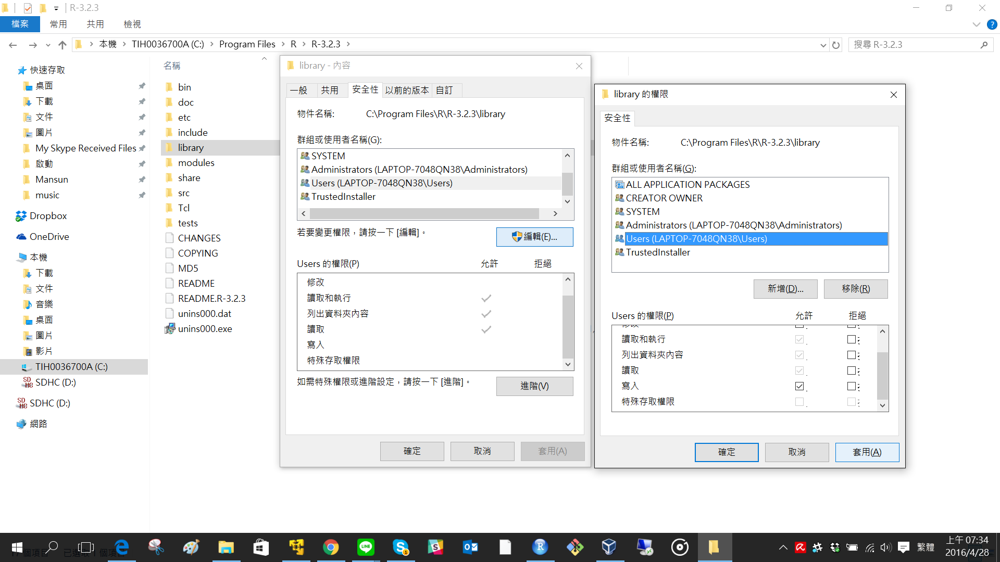

```{r include=FALSE}
knitr::opts_chunk$set(echo = TRUE)
```

# <br><br>Package {.white}


# libPaths

Libraries in R are loaded in order:

```{r}
.libPaths()
```

You can also add an additional library path:

```r
.libPaths(c("your/library/path", .libPaths()))
```


# Change Privilege(Windows)




# References

- [Managing libraries](https://support.rstudio.com/hc/en-us/articles/215733837-Managing-libraries)