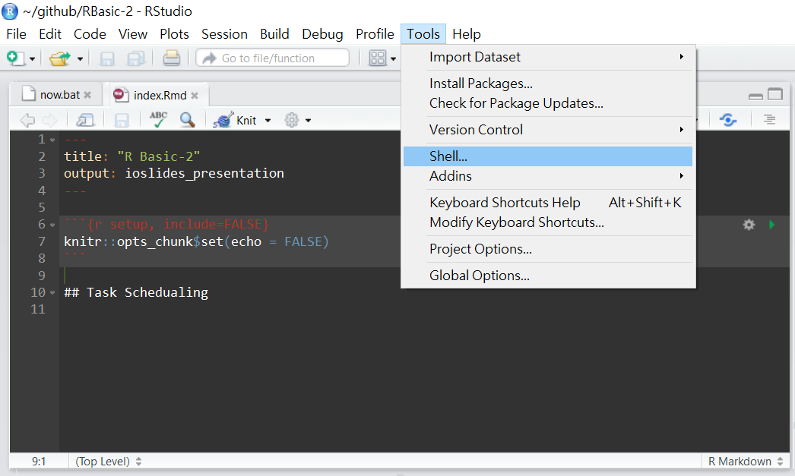
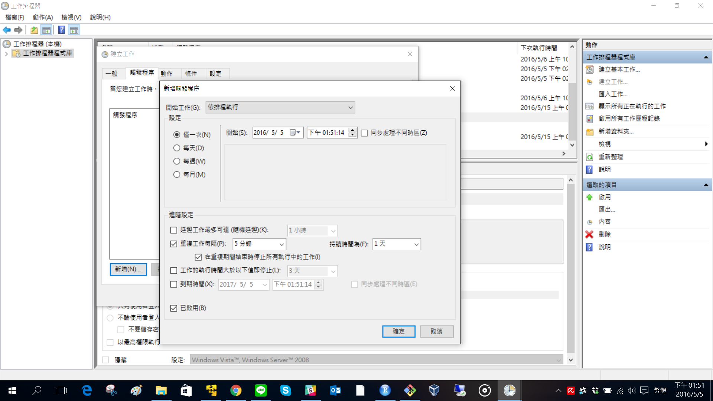
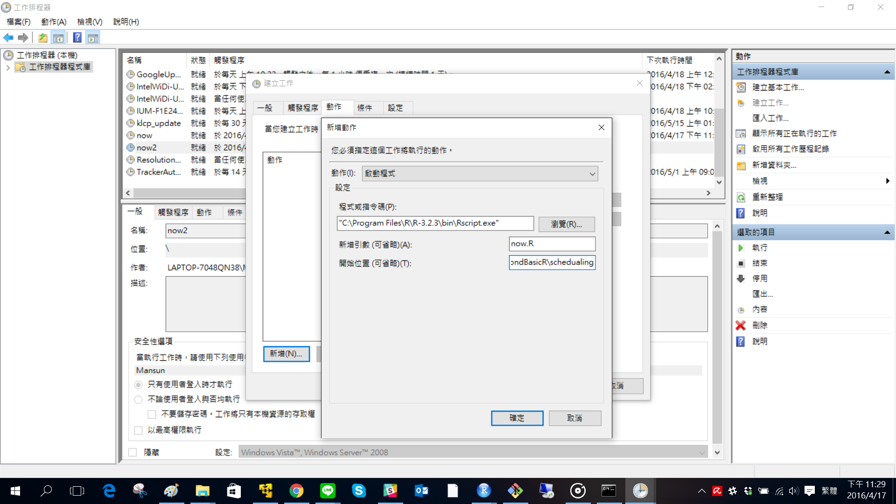

```{r include=FALSE}
knitr::opts_chunk$set(echo = TRUE)
```

# Schedualing {.white .Section}


# Task Schedualing in R

Sometime you may need to execute your R script periodically and automatically: 

- **Regular Report**: Generate monthly/daily report automatically
- **Crawler**: Get latest data every hour
- **Forecasting System**: Rebuild your preditive model with latest data


# Steps to Schedualing

1. Invoking a batch job of R
    - RScript
    - R CMD BATCH
2. Passing arguments to R
3. A schedualer:
    - Windows: Task Schedualer
    - Linux/Mac: Crontab
    
    

# Open shell with RStudio

Environment variable of R and RScript will be exported in this way.




# Invoke a batch job

- **Rscript**
    - A binary front-end to execute a R script
    - Recommended 
    - Execute a R script: Just like other programming language, you can pass arguments to your R script 

```bash
Rscript <PATH OF YOUR R SCRIPT> <ARG1> <ARG2> ...
```

- **R CMD BATCH**
    - Run R in batch mode
    - I never use this one since I use Rscript


# Shebang

If you use Linux or Mac, you can execute a R script directly with
[shebang](https://en.wikipedia.org/wiki/Shebang_(Unix))
and permission of execution.

```r
#!/usr/bin/env Rscript
```

Add permission of execution:

```{r engine='bash', echo=TRUE}
chmod u+x schedualing/now.R
```

Check permission:

```{r engine='bash', echo=TRUE}
ls -l schedualing/now.R
```


# Passing arguments

- Function:
    - **commandArgs**: a function to access command line arguments

- Package:
    - [argparser](https://cran.r-project.org/web/packages/argparser/index.html): Command-line argument parser written purely in R
    - [ArgParser](https://github.com/everdark/ArgParser): a command line argument parser for R from Kyle
    - [argparse](https://cran.r-project.org/web/packages/argparse/index.html): Analog to Python's argparse
    - [optparse](https://cran.r-project.org/web/packages/optparse/index.html): Analog to Python's optparse

In most situation, I will use a package to dealing with arguments parsing.


# Exercise

Please download [our github repository](https://github.com/mansunkuo/BeyondBasicR) under *github* directory.
Let's try to pass some arguments to [schedualing/now.R](schedualing/now.R): 

Get help:

```bash
Rscript schedualing/now.R -h
```

Pass a positional argument:

```bash
Rscript schedualing/now.R Mansun
```

Add a flag *-c*:

```bash
Rscript schedualing/now.R Mansun -c
```

Add a optional argument:

```bash
Rscript schedualing/now.R Mansun -c -g "How are you?"
```


# now.R


```{r results='asis', echo=FALSE}
catfile = "schedualing/now.R"
cat("```r",
    readChar(catfile, nchars = file.info(catfile)$size),
    "```",
    sep = "\n"
    )
```


# Task Schedualer(Windows)

Launch task scheduler on Windows:

1. Press **Windows Logo+R** to run dialog box
2. Enter *control schedtasks*

Launch task schedualer within RStudio:

```r
# Execute a system conmmand to launch task schedualer
system("control schedtasks")
```


# Set trigger




# Set job




# Crontab(Linux/Mac)

Maintain crontab files to execute scheduled commands in Unix-like OS for individual users.

```
crontab [-u user] file  
crontab [ -u user ] [ -i ] { -e | -l | -r }  
    -e      (edit user's crontab)  
    -l      (list user's crontab)  
    -r      (delete user's crontab)  
    -i      (prompt before deleting user's crontab)  
```

You may need to use some command line editor like vim
when using *crontab -e* to edit your crontab.
Type *select-editor* in terminal to choose your favorite editor


# Your first crontab 

- Download [our github repository](https://github.com/mansunkuo/BeyondBasicR) under *github* directory
- Make sure your library *argparser* are installed systemwide.
- Open [crontab.txt](schedualing/crontab.txt). Edit it as your full path and save it.
  Always change directory to your working directory to prevent unexpected error.

```bash
# Execute every minutes 
* * * * * cd /home/mansun/github/BeyondBasicR/schedualing; ./now.R Mansun
```
- Open your terminal and enter following command

```
crontab schedualing/crontab.txt
```

- Type *crontab -l* to check your crontab:

```{r engine='bash'}
crontab -l
```


# Configure your cron job

```
┌───────────── min (0 - 59) 
│ ┌────────────── hour (0 - 23)
│ │ ┌─────────────── day of month (1 - 31)
│ │ │ ┌──────────────── month (1 - 12)
│ │ │ │ ┌───────────────── day of week (0 - 6) (0 to 6 are Sunday to Saturday)
│ │ │ │ │
* * * * *  command to execute
```

- Comments begin with a comment mark **#**
- Separate items of a list with **Comma(,)**.

```
# Execute at 00:00 and 12:00 everyday
0 0,12 * * *  command to execute
```

- Define ranges with **Hyphen(\-)**

```
# Execute at 06:00 every Monday to Friday
0 6 * * 1-5  command to execute
```

Please refer to 
[Cron](https://en.wikipedia.org/wiki/Cron)
for further information.


# Exercise 

Set a schedualing job on your favorite OS.


# References

- [cron](https://en.wikipedia.org/wiki/Cron)
- [Scheduling R Tasks via Windows Task Scheduler](https://trinkerrstuff.wordpress.com/2015/02/11/scheduling-r-tasks-via-windows-task-scheduler/)
